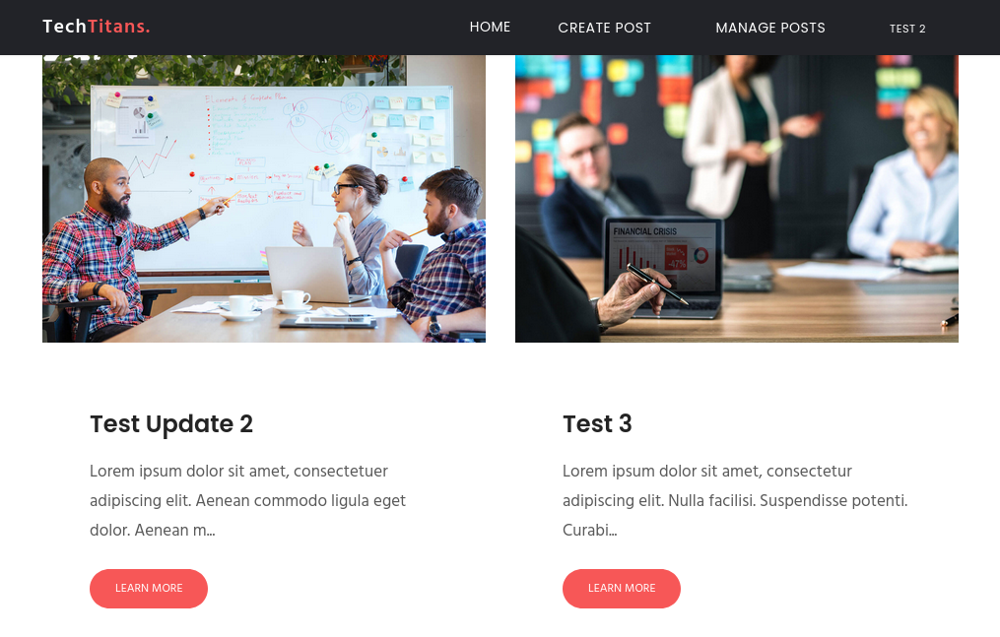

# TechTitans Blog



TechTitans Blog is a modern tech blog that covers the latest trends, tutorials, and news in technology. Whether you're a developer, tech enthusiast, or simply curious about the future of tech, TechTitans Blog has something for you.


---

## Table of Contents

- [About The Project](#about-the-project)
- [Built With](#built-with)
- [Getting Started](#getting-started)
  - [Prerequisites](#prerequisites)
  - [Installation](#installation)
- [Usage](#usage)
- [Screenshots](#screenshots)
- [Roadmap](#roadmap)
- [Contributing](#contributing)
- [License](#license)
- [Contact](#contact)
- [Contributors, Forks, Stargazers, Issues](#contributors-forks-stargazers-issues)
- [Acknowledgments](#acknowledgments)

---

## About The Project


TechTitans Blog is a tech blog platform built to provide engaging, insightful, and timely content about technology. This blog offers articles, tutorials, and industry news to help you stay updated in the fast-paced world of tech.

**Key Features:**
- Responsive design with a mobile-first approach
- Dynamic content loaded via a backend API
- User engagement through comments, likes, and shares
- SEO optimized for better search rankings

[Back to top](#table-of-contents)

---

## Built With

- **React:** A JavaScript library for building user interfaces.
- **Express.js:** A minimal and flexible Node.js web framework.
- **MongoDB Atlas:** A cloud database for scalable applications.
- **JWT:** JSON Web Tokens for secure authentication.
- **Bootstrap 5:** For responsive, modern design.
- **Render:** Cloud platform for hosting the application.

[Back to top](#table-of-contents)

---

## Getting Started

Follow these instructions to get the project running locally.

### Prerequisites

- [Node.js](https://nodejs.org/) (latest version recommended)
- npm (comes with Node.js)
- A MongoDB Atlas account with a connection string

```sh
npm install npm@latest -g
```

### Installation

1. **Clone the repository:**

   ```sh
   git clone https://github.com/AKW254/TechTitans.git
   ```

2. **Navigate to the project directory:**

   ```sh
   cd TechTitans
   ```

3. **Install dependencies:**

   ```sh
   npm install
   ```

4. **Create a `.env` file** in the root directory and add the following environment variables:

   ```sh
   NODE_ENV=production
   PORT=5000
   MONGO_URI=mongodb+srv://<username>:<password>@cluster0.mongodb.net/TechTitansBlog?retryWrites=true&w=majority
   JWT_SECRET=your_secret_key
   JWT_EXPIRES_IN=1d
   ```

5. **Start the server:**

   ```sh
   npm start
   ```

[Back to top](#table-of-contents)

---

## Usage

The API exposes endpoints for managing blog content and user authentication. Some key endpoints include:

- `POST /api/auth/register` - Register a new user.
- `POST /api/auth/login` - Login and receive a JWT.
- `GET /api/posts` - Retrieve all blog posts.
- `POST /api/posts` - Create a new blog post (requires authentication).
- `PUT /api/posts/:id` - Update an existing blog post.
- `DELETE /api/posts/:id` - Delete a blog post.

For full API documentation, please refer to the docs in the repository.

[Back to top](#table-of-contents)

---

## Screenshots

### Sign up Screen

### Sign In Screen

### Home Screen

### Single Post  Screen

### Create Post Screen

### Manage Posts Screen


[Back to top](#table-of-contents)

---

## Roadmap

- [ ] Add unit and integration tests
- [ ] Enhance error handling and logging
- [ ] Implement role-based access control for authors and admins
- [ ] Deploy a complete frontend with React

[See open issues](https://github.com/AKW254/TechTitans/issues)

[Back to top](#table-of-contents)

---

## Contributing

Contributions are welcome! To contribute:

1. Fork the project.
2. Create your feature branch (`git checkout -b feature/new-feature`).
3. Commit your changes (`git commit -m 'Add new feature'`).
4. Push to the branch (`git push origin feature/new-feature`).
5. Open a pull request.

[](https://github.com/AKW254/TechTitans/graphs/contributors)

[Back to top](#table-of-contents)

---

## License

Distributed under the MIT License. See `LICENSE` for details.

[Back to top](#table-of-contents)

---

## Contact

Antony Kilonzo Wambua - [LinkedIn](https://www.linkedin.com/in/antony-wambua-293459265/) - [GitHub](https://github.com/AKW254) - kilonzowambua254@gmail.com

Project Link: [TechTitans Blog Repo](https://github.com/AKW254/TechTitans)

[Back to top](#table-of-contents)

---

## Contributors, Forks, Stargazers, Issues

- **Contributors:** [](https://github.com/AKW254/TechTitans/graphs/contributors)
- **Forks:** [](https://github.com/AKW254/TechTitans/network/members)
- **Stargazers:** [](https://github.com/AKW254/TechTitans/stargazers)
- **Issues:** [](https://github.com/AKW254/TechTitans/issues)
- **License:** 
- **LinkedIn:** [](https://www.linkedin.com/in/antony-wambua-293459265)

[Back to top](#table-of-contents)

---

## Acknowledgments

- [MongoDB Atlas](https://www.mongodb.com/atlas)
- [Render](https://render.com/)
- [Node.js](https://nodejs.org/)
- [Express.js](https://expressjs.com/)
- [JWT](https://jwt.io/)
- [Img Shields](https://shields.io/)
- [GitHub Pages](https://pages.github.com/)

[Back to top](#table-of-contents)
```

Make sure to replace the placeholder URLs, repository names, and any other details with your actual project data. This updated README provides a comprehensive overview of your TechTitans Blog project for GitHub.
